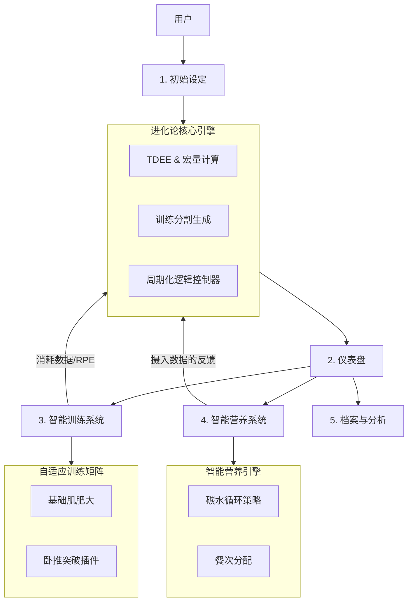

# 进化论 (Evolution Body System) - 产品设计方案与系统架构书

**版本**: 1.2  
**作者**: 首席产品设计师  
**日期**: 2025-12-07

---

## 1. 产品架构图 (Product Structure)

本系统采用模块化设计，以“用户状态”为核心驱动，连接“营养”与“训练”两大引擎。

### 核心功能模块 (Core Functional Modules)

经确认，系统包含以下 **5 大核心功能模块**：

1.  **初始设定与评估 (Onboarding & Assessment)**
    *   **功能**: 用户基础数据采集（身体成分、PR数据、生活方式）与目标锚定（增肌/减脂/力量）。
    *   **输出**: 初始 TDEE、1RM 估算、训练分割推荐。

2.  **仪表盘 (Dashboard - "进化中心")**
    *   **功能**: 用户的每日行动指挥塔。
    *   **包含**: “今日任务”（练什么+吃多少）、恢复状态概览、快速记录入口。

3.  **智能训练系统 (Smart Training System)**
    *   **动态计划生成**: 自适应肌肥大矩阵，支持根据天数自动排课。
    *   **训练执行与记录**: 交互式记录界面（重量/次数/RPE/休息计时）。
    *   **卧推专家模块 (Bench Press Specialist)**: 独立的 1RM 突破周期化算法引擎。

4.  **智能营养系统 (Smart Nutrition System)**
    *   **引擎核心**: TDEE 与宏观营养素计算。
    *   **碳水循环控制器**: 自动判断“高/中/低”碳水日，并联动训练日程。
    *   **餐单规划**: 每日餐次建议与食物记录。

5.  **用户档案与数据分析 (Profile & Analytics)**
    *   **功能**: 长期数据追踪。
    *   **包含**: 力量增长曲线、身体围度变化图表、系统设置与重置。

### 核心页面流转与架构图 (System Architecture)

---

## 2. 核心算法逻辑 (The Logic)

本系统的核心在于**“训练-营养动态耦合” (Training-Nutrition Dynamic Coupling)**。

### A. 智能营养引擎 (Smart Nutrition Engine)

#### 1. 热量基准 (Baseline)
*   **BMR (基础代谢)**: 采用 Mifflin-St Jeor 公式。
*   **TDEE (每日总消耗)**: BMR * 活动系数 + 运动消耗估算。
*   **目标热量**:
    *   **增肌 (Lean Bulk)**: TDEE + 250~500 kcal
    *   **减脂 (Cut)**: TDEE - 300~500 kcal
    *   **重组 (Recomp)**: TDEE ± 0 (维持热量，依靠宏量配比调整)

#### 2. 碳水循环算法 (Carb Cycling Algorithm)
系统根据用户当天的训练内容，自动切换饮食模式：

*   **高碳日 (High Carb Day)**
    *   **触发条件**: 大肌群训练 (腿、背)、全身高容量训练、或 **卧推极限突破日**。
    *   **宏量分配**:
        *   碳水: 50% - 60% (提供糖原填充)
        *   蛋白: 30% (2.0-2.2g/kg 体重)
        *   脂肪: 10% - 20% (最低限度)
    *   **目的**: 最大化运动表现，促进胰岛素分泌以通过mTOR路径合成肌肉。

*   **中碳日 (Moderate Carb Day)**
    *   **触发条件**: 小肌群训练 (肩/臂)、辅助训练日。
    *   **宏量分配**: 均衡分配，碳水适中维持糖原库存。

*   **低碳日 (Low Carb Day)**
    *   **触发条件**: 休息日 (Rest Day)、主动恢复日。
    *   **宏量分配**:
        *   碳水: 10% - 20% (仅保留基础脑部供能)
        *   蛋白: 40% - 50% (提高热效应，防止掉肌肉)
        *   脂肪: 30% - 40% (作为主要能源)
    *   **目的**: 提高胰岛素敏感性，最大化脂肪氧化。

### B. 卧推力量突破算法 (Bench Press Specialist Logic)

*   **1RM 推算**: 使用 Epley 公式或 Brzycki 公式动态更新。
*   **周期化模型**: 采用 **5/3/1 变体** 或 **线性周期 (Linear Periodization)**。
    *   **Week 1**: 70% 1RM x 3组 x 8-10次 (积累容量)
    *   **Week 2**: 80% 1RM x 4组 x 4-6次 (强度提升)
    *   **Week 3**: 90% 1RM x 3组 x 2-3次 (神经适应)
    *   **Week 4**: Deload (减载)，50% 1RM 做恢复性训练。
*   **辅助项关联**: 若卧推粘滞点(Sticking Point)在底部 -> 增加胸大肌停顿卧推；若在锁定阶段 -> 增加窄距卧推/三头肌训练。

---

## 3. 训练计划模板示例 (Sample Program)

**用户画像**:
*   **目标**: 侧重增肌 + 卧推突破
*   **频率**: 一周 5 练
*   **模式**: PPL (推/拉/腿) + Upper/Lower (上/下) 混合分化

### 训练周安排 (Training Week)

| 天数 | 训练模块 | 重点 | 对应饮食模式 |
| :--- | :--- | :--- | :--- |
| **Mon** | **Push (推) + Bench Focus** | **卧推PR突破核心日** | **高碳 (High Carb)** |
| **Tue** | Pull (拉) | 背部厚度与宽度 | 中碳 (Mod Carb) |
| **Wed** | Legs (腿) | 深蹲/股四头肌 | **高碳 (High Carb)** |
| **Thu** | *Rest (休息)* | 主动恢复 | **低碳 (Low Carb)** |
| **Fri** | Upper (上肢肥大) | 肩/胸/背 (容量导向) | 中碳 (Mod Carb) |
| **Sat** | Lower (下肢力量) | 硬拉/腘绳肌 | **高碳 (High Carb)** |
| **Sun** | *Rest (休息)* | 完全休息 | **低碳 (Low Carb)** |

### 具体课表: Monday (Push - Bench Specialist)

> **目标**: 提升卧推绝对力量，同时刺激推类肌群肥大。

1.  **[热身] 肩袖激活 (Rotator Cuff Activation)**
    *   面拉 (Face Pulls) - 2组 x 15次
    *   弹力带外旋 - 2组 x 15次

2.  **[核心 - 力量] 杠铃平地卧推 (Barbell Bench Press)**
    *   *算法生成 (基于 1RM 100kg 例)*:
    *   Set 1 (Warm): 50kg x 8
    *   Set 2 (Warm): 70kg x 4
    *   **Work Set 1**: 85kg (85%) x 5次 (RPE 8)
    *   **Work Set 2**: 85kg (85%) x 5次 (RPE 8.5)
    *   **Work Set 3**: 85kg (85%) x 5+次 (AMRAP - 尽可能多做，留1次力竭)
    *   *逻辑*: 最后一组 AMRAP 决定下周是否涨重量。

3.  **[辅助 - 锁定] 窄距卧推 (Close-Grip Bench Press)**
    *   3组 x 8-10次 (侧重三头肌长头)

4.  **[肌肥大 - 胸] 上斜哑铃卧推 (Incline Dumbbell Press)**
    *   3组 x 10-12次 (控制离心阶段 2秒)

5.  **[肌肥大 - 肩] 哑铃侧平举 (Lateral Raises)**
    *   4组 x 15-20次 (超级组，组间休息短)

6.  **[肌肥大 - 三头] 绳索下压 (Tricep Pushdowns)**
    *   3组 x 12-15次 (力竭组)

---

## 4. 页面功能清单 (Feature List)

### P0 - MVP 核心功能 (Must Have)
1.  **User Profile System**: 基础数据录入、TDEE计算器。
2.  **Dynamic Training Plan Generator**: 基于天数/部位自动生成Split。
3.  **Nutrition Calculator**: 碳水循环逻辑实现。
4.  **Bench Press Tracker**: 1RM记录与周期化计算。

### P1 - 进阶功能 (Should Have)
1.  **Auto-Regulation**: RPE 自动调节。
2.  **Detailed Meal Planner**: 餐次建议。
3.  **Rest Timer**: 智能倒计时。

### P2 - 差异化体验 (Nice to Have)
1.  **Plate Calculator**: 杠铃配重计算。
2.  **Deload Mode**: 减载周模式。

---

## 5. 技术架构选型 (Technical Architecture)

经确认，本系统采用 **方案 A: "The Agile Soloist" (全栈极速开发)**。

### 技术栈 (Tech Stack)
*   **前端框架**: **Next.js 14+ (App Router)** - 使用 React Server Components。
*   **编程语言**: **TypeScript** - 保证全栈类型安全。
*   **后端逻辑**: **Next.js Server Actions** - 无需独立后端服务。
*   **数据库**: **Supabase (PostgreSQL)** - 托管的关系型数据库。
*   **UI 组件库**: **Tailwind CSS + shadcn/ui** - 快速构建美观界面。

### 商业化与扩展性分析 (Commercial Viability)

针对**独立开发**与**未来商业化**的考量，此方案完全胜任：

1.  **初期成本极致低**:
    *   Vercel 和 Supabase 均提供强大的 Free Tier，在拥有前 1000 名付费用户前，基建成本几乎为零。
    *   单人维护单一仓库 (Monorepo)，开发效率是分离架构的 2-3 倍。

2.  **商业化支撑 (Stripe Ready)**:
    *   Next.js 社区拥有最成熟的 Stripe 支付集成方案 (订阅制/买断制)。
    *   Supabase Auth 内置了完善的用户鉴权，配合 Row Level Security (RLS) 保护付费内容的安全性。

3.  **性能与扩展 (Scalability)**:
    *   **数据库**: Supabase 本质是 PostgreSQL。当用户量达到百万级，可以直接迁移到 AWS RDS 或自行托管，数据结构无需改变。
    *   **前端**: Vercel 的 Edge Network 保证全球访问速度。
    *   **性能瓶颈**: 只有当且仅当需要进行极高频的实时数据计算（如每秒 1000 次的传感器数据分析）时，才需要考虑引入 Go/Rust 微服务，届时只需将该模块剥离即可。

**结论**: 这是一个**“进可攻（快速迭代），退可守（低成本运维）”**的又稳又快的最佳选择。

---

## 6. 实施细则 (Implementation Details)

### 6.1 数据策略 (Data Strategy - "Pro-Loaded")

*   **预装数据 (Seeded Library)**:
    *   **动作库**: 系统内置 50+ 个经过筛选的 "Golden Standard" 动作（如杠铃卧推、深蹲、引体向上），包含标准名称、目标肌群、推荐 1RM 百分比。
    *   **食材库**: 预置常见“清洁饮食”食材（鸡胸肉、燕麦、糙米、橄榄油等）的宏量数据。
*   **用户自定义 (Customization)**:
    *   支持用户**编辑**现有的预装动作（例如：修改默认推荐重量）。
    *   支持**导入/创建**新动作，允许用户构建属于自己的“私有动作库”。

### 6.2 UI/UX 设计语言 (Design System - "Premium Minimalist")

目标打造类似 Apple 原生应用的高端、克制风格。

*   **视觉风格 (Visual Style)**:
    *   **色彩 (Palette)**:
        *   **背景**: 纯白 (Light Mode) / 深灰 #1C1C1E (Dark Mode)。拒绝纯黑，使用高级灰增加层次。
        *   **主色 (Primary)**: **克莱因蓝 (International Klein Blue)** 或 **苹果健身环绿**。仅用于“开始训练”、“完成”、“关键数据高亮”。拒绝大面积色块。
        *   **文字**: San Francisco (iOS) / Inter 字体。使用字重 (Bold/Semibold) 而非颜色来区分层级。
    *   **质感**: 适度使用毛玻璃 (Backdrop Blur) 效果用于导航栏和弹窗，保持通透感。
*   **交互原则 (Interaction)**:
    *   **Micro-interactions**: 按钮点击的缩放反馈、从列表中划动删除/编辑、进度条的平滑动画。
    *   **Haptic Feedback**: 手机端操作（如倒计时结束、记录一组数据）触发震动反馈。

### 6.3 移动端优先与响应式策略 (Mobile-First & Responsive)

*   **核心逻辑**: 视作一个 **Native-Like Web App**。
*   **移动端 (Mobile)**:
    *   导航栏底置 (Bottom Tab Bar)，方便单手拇指操作。
    *   触控区域 (Touch Targets) 至少 44x44px。
    *   避免复杂的表格，改用卡片流 (Card Flow) 展示数据。
*   **桌面端 (Desktop)**:
    *   利用宽屏优势，将底栏转换为左侧侧边栏 (Sidebar)。
    *   训练过程页从“单卡片轮播”变为“双栏布局”（左侧动作列表，右侧当前记录板）。

### 6.4 后台管理系统 (Admin Portal)

为了满足商业化运营与内容维护需求，将在同一项目中集成**管理端**功能。

*   **架构方式 (Architecture)**:
    *   采用 **Monorepo** 模式，直接集成在现有 Next.js 项目的 `/admin` 路由下。
    *   通过 Supabase Auth 的 RBAC (基于角色的权限控制) 限制访问，仅 `role: admin` 用户可进入。
*   **核心功能 (Core Features)**:
    *   **内容管理 (CMS)**: 增删改查“官方动作库”和“官方食材库”，支持批量导入。
    *   **用户管理 (User Ops)**: 查看用户列表、禁用违规账户、重置密码。
    *   **数据看板 (Analytics)**: 每日新增用户、活跃用户趋势、最受欢迎的训练动作排名。

